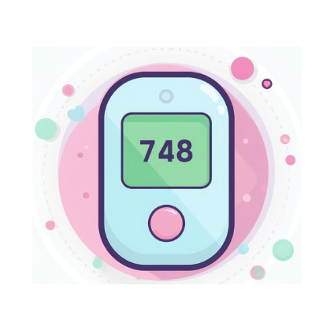
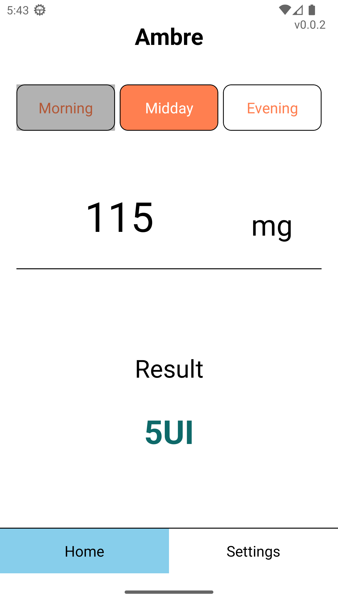
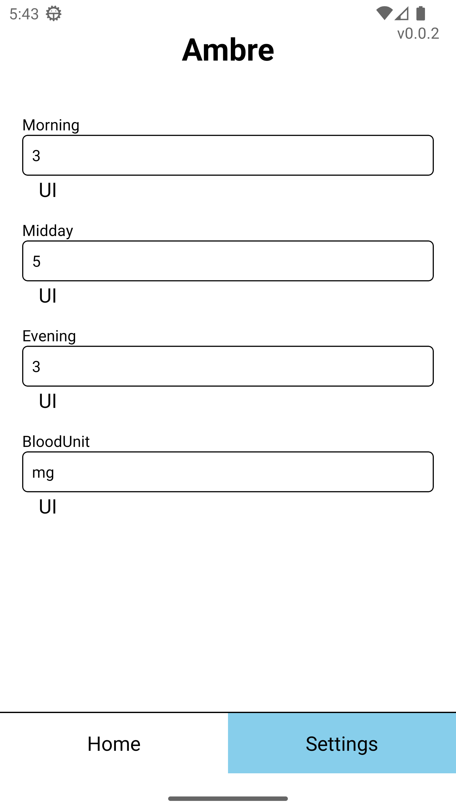

<h1 style="text-align:center;" >  Ambre</h1>

<p style="text-align:center;">
    
</p>


[](https://app.codacy.com/gh/NY-Daystar/Ambre/dashboard?utm_source=gh&utm_medium=referral&utm_content=&utm_campaign=Badge_grade)
[](https://github.com/NY-Daystar/ambre/actions/workflows/js.yml)
[](https://www.gnu.org/licenses/gpl-3.0)
[](https://github.com/NY-Daystar/ambre/releases)


Developped in React-Native and Expo to calculate blood sugar unit for insuline  
Source code analysed with [DeepSource](https://deepsource.com/) and [Codacy](https://app.codacy.com)

## Summary

- [Requirements](#requirements)
- [User guide](#user-guide)
- [Get started](#get-started)
    - [Install application](#install-application)
    - [Unit tests](#tests)
    - [Build application](#build-application)
    - [Publish application](#publish-application)
- [Contact](#contact)
- [Credits](#credits)

## Requirements

- [JDK 11](https://www.oracle.com/fr/java/technologies/downloads/)
- [npm (=> v11.9.0) & node (=> v25.6.1)](https://nodejs.org/en)
- [Android Studio](https://developer.android.com/studio)
    - Configure a device with `Virtual Device Manager`
    - `SDK` => version 33
    - `build-tools & platform-tools` => v33.0.0
- `adb.exe` (Android Debug Bridge)
    - Automatically installed with Android Studio or SDK

## User guide

This application allows user to calculate Insulin unit to take regards their blood sugar ratio

1. Just put seize blood sugar ratio here, you can also change your settings

<p style="text-align:center;">
     
</p>

## Get started

1. Clone the repository

```bash
git clone git@github.com:NY-Daystar/Ambre.git
```

> You can activate git hooks with this command

```bash
git config --global core.hooksPath .githooks
```

2. Install dependencies

    ```bash
    npm install
    ```

3. Start the app

    ```bash
    npm start
    ```

In the output, you'll find options to open the app in a

- [development build](https://docs.expo.dev/develop/development-builds/introduction/)
- [Android emulator](https://docs.expo.dev/workflow/android-studio-emulator/)
- [iOS simulator](https://docs.expo.dev/workflow/ios-simulator/)
- [Expo Go](https://expo.dev/go), a limited sandbox for trying out app development with Expo

You can start developing by editing the files inside the **app** directory. This project uses
[file-based routing](https://docs.expo.dev/router/introduction).

### Install application

You can install application in your smartphone
1. Download [apk file](https://github.com/NY-Daystar/Ambre/releases/download/v1.0.1/Ambre.apk)
2. Launch this file in your smartphone

### Tests

Unit tests are developped in `Jest`  
To launch them

```bash
npm test
```

### Build application

> Your app logo will be in 420x420 px 

1. Install `eas`

```bash
npm install -g eas-cli
```

2. log in

```bash
eas login
```

3. Configure your application

```bash
eas build:configure
```

4. Build app in specific profile
    - `development` profile
        ```bash
        eas build -p android --profile development
        ```
    - `preview` profile
        ```bash
        eas build -p android --profile preview
        ```
    - `production` profile
        ```bash
        eas build -p android --profile production
        ```

5. You can check your build [here](https://expo.dev/accounts/ny-daystar/projects/Ambre)

> it takes ~15-20min

### Publish application

1. You need to [build application] in `production` profile

2. Go into your [eas dashboard](https://expo.dev/accounts/ny-daystar)

> You need a google account

3. Go into [Google play console](https://play.google.com/console/u/0/signup)

    eas submit --platform android

4. Publish your application TODO Dans la Play Console :
    1. Create new application
    2. Filled :
        - Name
        - Description
        - Icon (512x512)
        - Screenshot
        - Confidentiality (mandatory)
    3. Import `.aab` file from [dashboard](https://expo.dev/accounts/ny-daystar/projects/Ambre)
    4. Fill the section :
        - Content classification
        - Public target audience
        - Data security
    5. Start publishing

5. Google will validate between 1 and 7 days

## Contact

- To make a pull request: https://github.com/NY-Daystar/ambre/pulls
- To summon an issue: https://github.com/NY-Daystar/ambre/issues
- For any specific demand by mail: [luc4snoga@gmail.com](mailto:luc4snoga@gmail.com?subject=[GitHub]%ambre%20Project)

## Credits

Made by Lucas Noga.  
Licensed under GPLv3.
